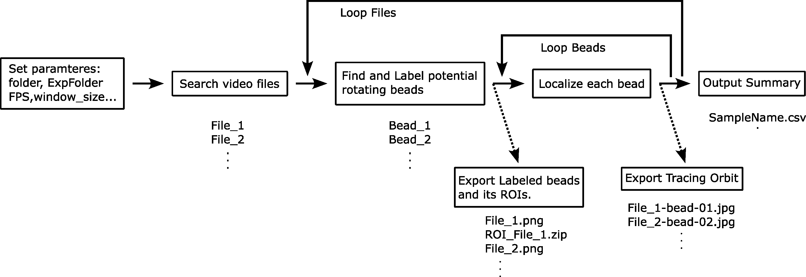

<h1 align="center">

</h1> 

Here collect my programs for analyzing the beads assay in the bacterial flagellar motor experiment.

## Features:
-  Output ROIs of the recognized beads in ImageJ format.
-  Batch process for mutiple files with different types (.seq, .tif) in the assigned folder.
-  Draw the trace of the rotating orbit and the power spectrum of FFT results.
-  Output the results in a CSV file, including speed, FFT peak, and ellipse fitting quality for further data filtration.

## Analyzing steps:
<h1 align="center">

</h1> 

1. Set the parameters.
2. Search the files to analyze. (The program can only analyze video as a stack of file.)
3. Loop the files.
   1. Segment the likely rotating beads by standard deviation of the pixel intensity. And label the region of interest. (Output the labeled image, and ROIs)
   2. Output the information of labled beads in each video file.
   3. Loop the beads.
      1. Localize the bead's position in each frame by calling GetBeadsPosition function.
      2. Output the bead's orbit.
4. Output the summary results for all the beads.

## How to use:
1.	Download this repository.
2.	Open the file,”SpeedDistribution.py”
3.	Set the parameters: folder, ExpFolder, SampleName, FPS, S_radius
4.	Run the program, it should show the progress. The program would generate a analysis folder to store the results.
